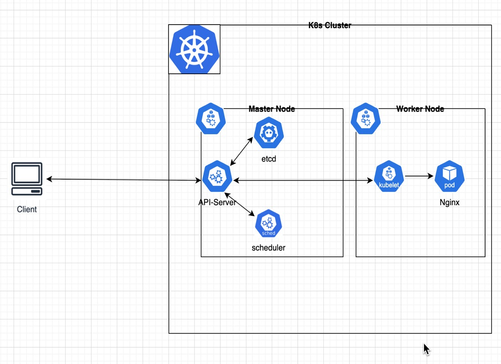

# Understanding Kuberenetes API Server

## About API Server component
This component is in the "heart" of every interaction between client and the k8s system.
Using `kubectl` command, client can interact with the system through the API Server.
We can actual bypass the kubectl cli tool and directly invoke requests into the API Server, like so:
`curl https://CONTROL_PLANE_HOST_NAME/api/v2/namespaces/default/pods` (example of listing pods in the default NS)

From [k8s-docs](https://kubernetes.io/docs/reference/command-line-tools-reference/kube-apiserver/):<br>
<i>The Kubernetes API server validates and configures data for the api objects which include pods, services, replicationcontrollers, and others. The API Server services REST operations and provides the frontend to the cluster's shared state through which all other components interact.</i>

---

## Under-The-Hood Flow (Example of Pod Creation Request):
1. Client invoke kubectl command for creating a pod (`kuebctl run nginx --image=nginx`)
2. Request is authenticated and validated
3. API Server creates pod object and inform the etcd cluster (reminder: etcd is a key-value store that holds the current state of the k8s cluster) 
4. Then API Server updates the user that the pod was created
5. Node Schduler, when its continously monitors the API Server - fetches the information about pod being created, and it should scheduler a node to it. 
6. Depend on the Schduler configurations, and the currnet state of the k8s cluster nodes - it "decides" on which node to place the newly created pod.
7. Schduler will then udpate the API server, which in turn will update the etcd cluster, and invoke a request to the kubelet running in the selected node, to create the pod.
8. The Kubelet will create the pod and instruct the container runtime to run the image in a container.
9. The kubelet then updates the API Server (for the pod's status), which in turn updates the etcd cluster, for that status.
---

---
Every time a change is requested in the k8s system, the same above flow will take place.

# 📘 Kubernetes API Server Tutorial: List Pods via Direct API Call

This guide shows how to authenticate and communicate directly with a local Kubernetes API server (e.g., a `kind` cluster) **without using `kubectl`**, by listing pods in the `default` namespace via a raw `curl` request.

---

## 🛠 Prerequisites

- Local Kubernetes cluster (e.g., [kind](https://kind.sigs.k8s.io/))
- `kubectl` installed and configured
- `curl`, `base64`, `jq`, and `bash` installed
- And finally: Create a single nginx pod: `kubectl run nginx --image=nginx`

---

## ✅ Step-by-Step: List Pods via API Server

### 1. Create a Script

Create a script named `list-pods.sh`:

```bash
#!/bin/bash

# Extract API server URL
SERVER=$(kubectl config view --minify -o jsonpath='{.clusters[0].cluster.server}')

# Decode embedded certs from kubeconfig into temp files
CLIENT_CERT_FILE=$(mktemp)
CLIENT_KEY_FILE=$(mktemp)
CA_CERT_FILE=$(mktemp)

kubectl config view --raw --minify -o jsonpath='{.users[0].user.client-certificate-data}' | base64 -d > "$CLIENT_CERT_FILE"
kubectl config view --raw --minify -o jsonpath='{.users[0].user.client-key-data}' | base64 -d > "$CLIENT_KEY_FILE"
kubectl config view --raw --minify -o jsonpath='{.clusters[0].cluster.certificate-authority-data}' | base64 -d > "$CA_CERT_FILE"


```
### 2. Make It Executable
`chmod +x list-pods.sh`

### 3. Run It
`./list-pods.sh`

### 4. Call API Directly to list pods:
```bash
curl --cert "$CLIENT_CERT_FILE" \
     --key "$CLIENT_KEY_FILE" \
     --cacert "$CA_CERT_FILE" \
     "$SERVER/api/v1/namespaces/default/pods" | jq .
```

### 5. Results:
#### Top-Level:
```yml
{
  "kind": "PodList",
  "items": [...]
}
```
- This means the response is a list of pod objects. You have one pod in the list.

#### metadata:
Describes the pod itself:
```yml
"metadata": {
  "name": "nginx",
  "namespace": "default",
  ...
}
```
- name: Pod name (nginx)
- namespace: Where it lives (default)
- uid: Unique ID
- creationTimestamp: When it was created
#### spec:
This is the desired state — what the pod should be doing.
```yml
"spec": {
  "containers": [
    {
      "name": "nginx",
      "image": "nginx",
      ...
    }
  ],
  ...
}
```
- containers: List of containers in the pod (you have one: nginx)
- image: Docker image (nginx)
- volumeMounts: Mounts for service account tokens, configmaps, etc.
- restartPolicy: Set to Always (default for pods)

#### status:
This is the current state of the pod.
```yml
"status": {
  "phase": "Running",
  "podIP": "10.244.0.7",
  "conditions": [...],
  "containerStatuses": [...]
}
```
* phase: Lifecycle phase (Running)
* podIP: Cluster IP assigned to the pod
* conditions: Readiness, init, etc. (all True)
* containerStatuses: Runtime state of the container:
  * ready: true
  * started: true
  * restartCount: 0

### 6. Cleanup temp directories:
```bash
rm "$CLIENT_CERT_FILE" "$CLIENT_KEY_FILE" "$CA_CERT_FILE"
```

### 7. Notes 📌
- The request uses client certificate authentication extracted from your kubeconfig.
- The Kubernetes endpoint for listing pods is:
`GET /api/v1/namespaces/{namespace}/pods`
- This method avoids using kubectl and helps understand raw API communication with Kubernetes.