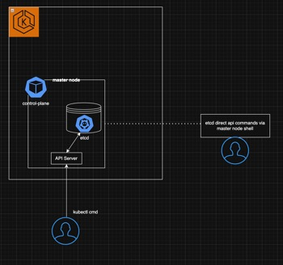

## What is etcd?
etcd is a distributed key-value store.

## What is a Key Value Store?
A key-value store is a type of database that stores data in a key-value format.
Querying this type of database is extremely fast and flexible, as there is no strict schema required for storing information.

## Etcd in Kubernetes
etcd serves as the brain of the Kubernetes cluster, storing all cluster information.

## Hands On
### Overview
In this quick hands on practice we expirience how data is stored and updated in etcd. <br>
The below diagram shows how we'll trigger kubctl commands to update information while interactig directly with etcd api from within the master node shell. <br>



### Prerequisites
* Deploy [kind](https://kind.sigs.k8s.io/docs/user/quick-start/) cluster locally
* When cluster is up and running:

### 🕵️‍♂️  View Kubernetes etcd pod
Inspect pods in the kube-system namespace containing `component: etcd` label:

```
kubectl -n kube-system get pods -l component=etcd
```

### 🔐 Access etcd in a Kubernetes cluster
Access the control plane node shell:

```
k -n kube-system exec -it etcd-kind-control-plane -- sh
```

### 🔍 Inspect all keys
You can query etcd database via its API, like so:

```
ETCDCTL_API=3 etcdctl \
  --endpoints=https://127.0.0.1:2379 \
  --cacert=/etc/kubernetes/pki/etcd/ca.crt \
  --cert=/etc/kubernetes/pki/etcd/server.crt \
  --key=/etc/kubernetes/pki/etcd/server.key \
  get "" --prefix --keys-only
```

This will return all keys stored currently in etcd.

### 🔍 Inspect information about kind-control-plane Node
To get information about the kind-control-plane node:

```
ETCDCTL_API=3 etcdctl \
  --endpoints=https://127.0.0.1:2379 \
  --cacert=/etc/kubernetes/pki/etcd/ca.crt \
  --cert=/etc/kubernetes/pki/etcd/server.crt \
  --key=/etc/kubernetes/pki/etcd/server.key \
  get /registry/minions/kind-control-plane
```

### ➕ Create a new namespace and observe it in etcd
Create a new namespace (replace <your-namespace> with your desired name):

```
kubectl create namespace <your-namespace>
```

Now, list the namespace keys in etcd to see your new namespace:

```
ETCDCTL_API=3 etcdctl \
  --endpoints=https://127.0.0.1:2379 \
  --cacert=/etc/kubernetes/pki/etcd/ca.crt \
  --cert=/etc/kubernetes/pki/etcd/server.crt \
  --key=/etc/kubernetes/pki/etcd/server.key \
  get /registry/namespaces/ --prefix --keys-only
```

You should see a key for your newly created namespace.

### 👀 Watch for changes to the namespace and apply a label
In **Terminal 1**, watch the etcd key for your namespace (replace <your-namespace> with your namespace name):

```
ETCDCTL_API=3 etcdctl \
  --endpoints=https://127.0.0.1:2379 \
  --cacert=/etc/kubernetes/pki/etcd/ca.crt \
  --cert=/etc/kubernetes/pki/etcd/server.crt \
  --key=/etc/kubernetes/pki/etcd/server.key \
  watch /registry/namespaces/<your-namespace>
```

In **Terminal 2**, add a label to the namespace:

```
kubectl label namespace <your-namespace> purpose=demo
```

You should see the change reflected in the output of Terminal 1 as etcd updates the namespace key.

