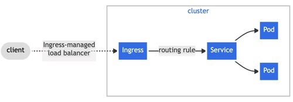

## About ingress
<i>protocol-aware configuration mechanism, that understands web concepts like URIs, hostnames, paths, and more</i>

Ingresss provides external cluster accsess to services within the cluster.
By exposing HTTP and HTTPS routes 

