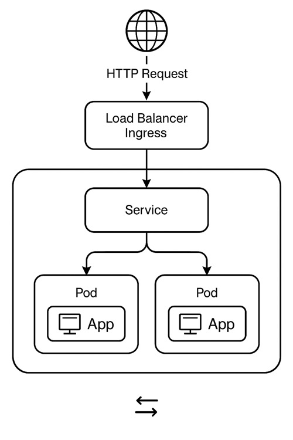

# Kubernetes App Deployment with Ingress on kind

This project demonstrates how to deploy a simple web application on a Kubernetes cluster using `kind`, with two replicas exposed via a Service and accessed through an Ingress controller.

---

## Prerequisites

- Docker
- [kind](https://kind.sigs.k8s.io/docs/user/quick-start/)
- kubectl
- curl (for testing)


### 🔧 1. Create kind Cluster with Port Mapping

In this tutorial we will set a minimal Working kind cluster kind-config.yaml (1 Control-Plane + 1 Worker, with Ingress Labels and Taint)

End result will be true to the following diagram:



then execute the command:<br> 
`kind create cluster --config kind-config.yaml`

### 🌐 2. Install NGINX Ingress Controller
`kubectl apply -f https://raw.githubusercontent.com/kubernetes/ingress-nginx/controller-v1.10.1/deploy/static/provider/kind/deploy.yaml`


### 🚀 3. Deploy the App (2 Replicas)
- `cd components/ingress/type-load-balancer`
- `kubectl apply -f app-deployment.yaml`

### 🔌 4. Expose App with a Service
 - `kubectl apply -f app-service.yaml`

 ### 🌍 5. Create an Ingress
 - `kubectl apply -f app-ingress.yaml`

### 🧪 6. Test the Setup
- `curl http://localhost:8080/`

### 🕵️‍♂️ 7. Inspect the results:
with each hit of the curl command you should get a response (in a round-robin type balancing) - from each pod at a time.

```
Hello from hello-app-xxxxx
Hello from hello-app-yyyyy
```
