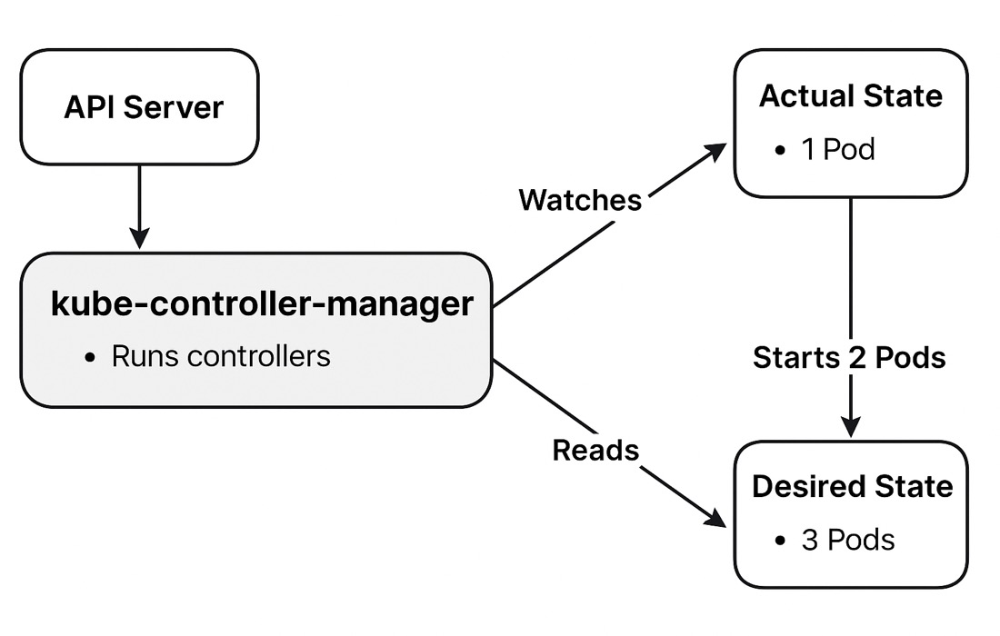

# Kubernetes kube-controller-manager

## Overview
The Kube Controller Manager, is the component responsible of implementing the core logic of the "control loop".
Whenever we want to make changes into our kuberenetes system, we need a mechanism that will "control" those changes. Meaning, move the system from the current state to the desired state.

## Responsibilities
- Monitoring  
  Constantly monitors the state of the system through the API Server. Tracking the current configs of resources in it.
- State Reconciliation  
  Compare the desired state as defined in the user request manifest with the actual state, it identified differences.
- Corrective Actions  
  When the controller detects deviations it perform the necessary actions to bring the system back to a non-deviative state.
  This would include:  
  - restart failed containers 
  - scale pods  
  - recreate resources.
 
 ## Common Controllers it Manages
1. Node Controller – Watches for node health (e.g., down nodes).
2. Replication Controller – Ensures the correct number of pod replicas are running.
3. Deployment Controller – Manages rollout and rollback of deployments.
4. Job Controller – Manages batch jobs until completion.
5. Service Account & Token Controller – Creates default accounts and secrets.

## How It Works (Basic Flow)
1. Reads desired state from the API Server (e.g., 3 replicas of a pod).
2. Watches actual state of the cluster (e.g., only 1 pod is running).
3. Takes action to match the actual state to the desired state (e.g., starts 2 more pods).

## Example 
1. Create a deployment:
`kubectl create deployment nginx --image=nginx --replicas=2`

2. Manually delete a pod:
`kubectl delete pod <nginx-pod-name>`

3. Watch it get recreated:
`kubectl get pods`

4. Check replicaset-controller logs via kube-controller-manager:
`kubectl logs pod/kube-controller-manager -n kube-system`

### you should see something like:
`"Finished syncing" logger="replicaset-controller" kind="ReplicaSet" key="default/nginx-bf5d5cf98" duration="38.917µs"`

### This log line from the replicaset-controller means:
- Sync completed for a ReplicaSet object.
- Kind: ReplicaSet
- Key: "default/nginx-bf5d5cf98" (namespace/name)
- Duration: 38.917µs (very fast!)
- Controller: replicaset-controller
- Logger: used by kube-controller-manager

High-level diagram of the process:  

