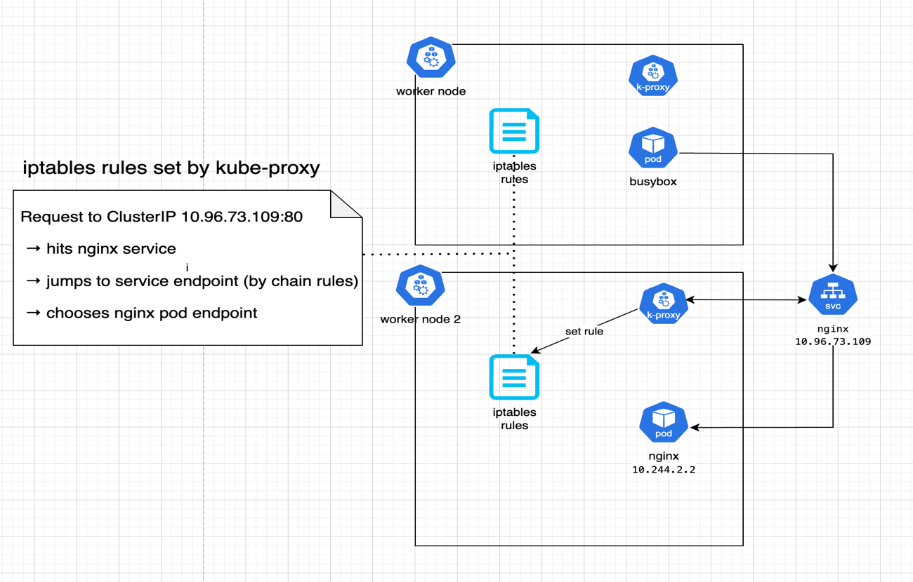

# Kube proxy

In Kubernetes, all pods can communicate with each other, even if they run on different nodes via "Pod Network".

For each pod we want to expose across the cluster, we create a "Service". This service allows us to communicate between pods by their names, instead of their IPs   which can change when a pod restarts. The Service gets an IP (although it is not a running process but merely a component inside of the Kubernetes memory). Service also holds the name of the pod (for example `sandbox`)   and thereby allows all other pods in the cluster to reach the pod by its name.

Kube proxy is a process that runs on each node in the cluster, and it is the one responsible for assigning the service IP address to the pod IP address, thereby creating a link between a service exposing the pod's name and the "final destination", which is the pod's IP address.

Kube proxy creates an `iptables` rule on each node on the cluster. to forward traffic heading to ip of the service, to the ip of the actual pod.

# 🔍 kube-proxy (iptables mode) Demo with NGINX in KinD

This tutorial walks you through setting up a local Kubernetes cluster with [KinD](https://kind.sigs.k8s.io/), deploying an NGINX service, and tracing how `kube-proxy` routes service traffic using `iptables` and `tcpdump`.




## 🧰 Prerequisites

- Docker
- [`kind`](https://kind.sigs.k8s.io/)
- `kubectl`

---

## 🚀 Step 1: Create a KinD Cluster

```bash
kind create cluster --name kubeproxy-demo --config components/kube-proxy/kind-config.yaml
```
Verify nodes:
```bash
kubectl get nodes
```


## 📦 Step 2: Deploy NGINX and Expose It


Create a deployment and expose it via a ClusterIP service:

```bash
kubectl create deployment nginx --image=nginx
kubectl expose deployment nginx --port=80 --type=ClusterIP
```
Verify
```bash
kubectl get pods -o wide
kubectl get svc nginx
```
Note the ClusterIP address (e.g., 10.96.73.109).

## 🧪 Step 3: Test NGINX from Inside the Cluster

Launch a temporary BusyBox pod and access the NGINX service:

```bash
kubectl run curl --rm -it --image=busybox --restart=Never -- sh
# Inside pod:
wget -qO- http://nginx
exit
```
You should see HTML content from the NGINX welcome page.


## 🔧 Step 4: Inspect kube-proxy iptables Rules

KinD runs nodes as Docker containers. exec into the worker container:
if needed - install iptables and iproute2 packages

```bash
docker exec -it kubeproxy-demo-worker bash
apt update && apt install -y iptables iproute2
```

once installed, you can check kube-proxy rules:

```bash
iptables-save | grep KUBE
```

Look for:
• KUBE-SERVICES: ClusterIP match
• KUBE-SVC-...: Per-service routing chains
• KUBE-SEP-...: Per-pod DNAT rules
• KUBE-MARK-MASQ: Marks packets for SNAT
• KUBE-POSTROUTING: Applies masquerading


Example route for NGINX:
```bash
-A KUBE-SERVICES -d 10.96.73.109/32 -p tcp --dport 80 -j KUBE-SVC-XXXXXXX
-A KUBE-SVC-XXXXXXX -j KUBE-SEP-YYYYYYY
-A KUBE-SEP-YYYYYYY -p tcp -j DNAT --to-destination 10.244.X.X:80
```

## 📡 Step 5: Trace Traffic with traffic logger

For this step I've made in advanced a "tcp-dumper" service that can easily configred (under `components/kube-proxy/traffic_logger`)

Replace:
 - 10.96.73.109 with the ClusterIP of the NGINX service
 - 10.244.X.X with the Pod IP from kubectl get pods -o wide

 and run
```bash
kubectl apply -f components/kube-proxy/traffic_logger
```

You’ll see packet flow like:
- SYN to service IP
- DNAT to pod IP
- Response from pod

Now in a second terminal, run:
```bash
docker exec -it kubeproxy-demo-worker tcpdump -nni any host 10.96.73.109 or host 10.244.X.X
```

## 🧹 Step 6: Cleanup
Delete the cluster:
```bash
kind delete cluster --name kubeproxy-demo
```

🧠 Summary

In this tutorial, you learned how to:
 - Deploy NGINX in a KinD cluster
 - Expose it via a ClusterIP service
 - Test access using BusyBox
 - Inspect kube-proxy iptables rules
 - Trace live traffic using tcpdump

This provides a hands-on understanding of how kube-proxy handles service-to-pod routing in iptables mode.