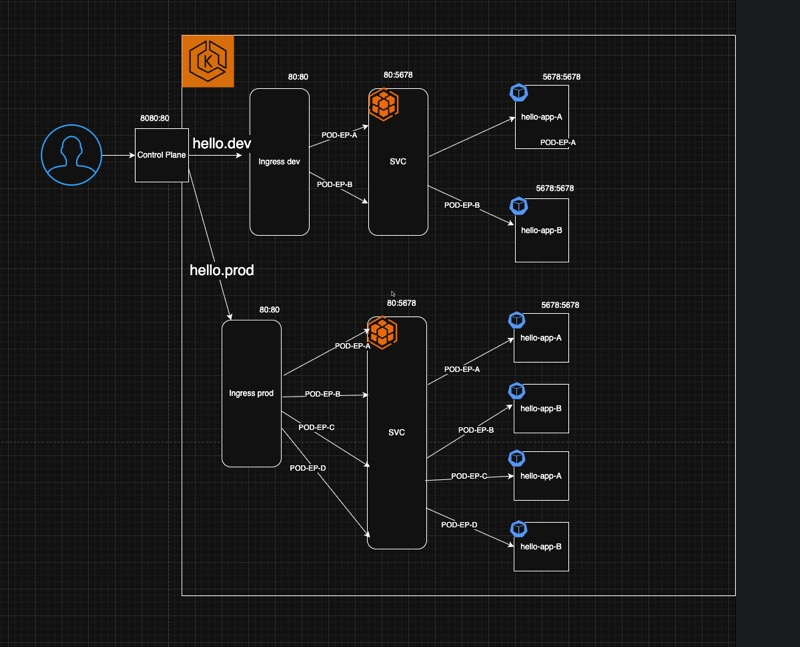

# Kustomize Implementation Guide

This repository contains a Kustomize implementation that demonstrates how to manage Kubernetes configurations across different environments (dev and prod) using a base configuration and overlays.

## 📁 Directory Structure

```
kustomize/
├── base/
│   ├── kustomization.yaml
│   ├── deployment.yaml
│   ├── service.yaml
│   └── ingress.yaml
├── overlays/
│   ├── dev/
│   │   ├── kustomization.yaml
│   │   ├── deployment_patch.yaml
│   │   ├── service_patch.yaml
│   │   └── ingress_patch.yaml
│   └── prod/
│       ├── kustomization.yaml
│       ├── deployment_patch.yaml
│       ├── service_patch.yaml
│       └── ingress_patch.yaml
└── README.md
```

## 🎯 What This Implementation Does

This Kustomize setup manages a simple "Hello World" application with:
- **Base Configuration**: Common configuration shared across environments
- **Dev Overlay**: Development-specific configurations (2 replicas, dev prefix)
- **Prod Overlay**: Production-specific configurations (4 replicas, prod prefix, different host)

## End result diagram:


## 🔧 Base Configuration

The base configuration defines the core Kubernetes resources:

### Deployment
- **Image**: `hashicorp/http-echo`
- **Replicas**: 1 (default)
- **Container Port**: 5678
- **Environment**: Uses pod name in the response message

### Service
- **Type**: ClusterIP (default)
- **Port**: 80 → 5678
- **Selector**: `app: hello`

### Ingress
- **Host**: `hello.dev`
- **Path**: `/`
- **Ingress Class**: nginx
- **Backend**: hello-service:80

## 🏗️ Step-by-Step Implementation Guide

### Step 1: Install Kustomize

```bash
# Install Kustomize
curl -s "https://raw.githubusercontent.com/kubernetes-sigs/kustomize/master/hack/install_kustomize.sh" | bash
sudo mv kustomize /usr/local/bin/
```

### Step 2: Understanding the Base Configuration

The base configuration in `base/kustomization.yaml` includes:
```yaml
apiVersion: kustomize.config.k8s.io/v1beta1
kind: Kustomization

resources:
- deployment.yaml
- service.yaml
- ingress.yaml
```

### Step 3: Build Base Configuration

```bash
# Build and view the base configuration
cd tools/kustomize/base
kustomize build .
```

### Step 4: Understanding Overlays

#### Dev Overlay Features:
- **Name Prefix**: `dev-` (creates dev-hello-app, dev-hello-service, etc.)
- **Labels**: Adds `variant: dev` to all resources
- **Replicas**: Scales deployment to 2 replicas
- **Host**: Keeps `hello.dev`

#### Prod Overlay Features:
- **Name Prefix**: `prod-` (creates prod-hello-app, prod-hello-service, etc.)
- **Labels**: Adds `variant: prod` to all resources
- **Replicas**: Scales deployment to 4 replicas
- **Host**: Changes to `hello.prod`

### Step 5: Build Environment-Specific Configurations

#### For Development Environment:
```bash
# Build dev configuration
cd tools/kustomize/overlays/dev
kustomize build .

# Or from the root directory
kustomize build tools/kustomize/overlays/dev
```

#### For Production Environment:
```bash
# Build prod configuration
cd tools/kustomize/overlays/prod
kustomize build .

# Or from the root directory
kustomize build tools/kustomize/overlays/prod
```

### Step 6: Deploy to Kubernetes

#### Deploy to Development:
```bash
# Apply dev configuration
kustomize build tools/kustomize/overlays/dev | kubectl apply -f -

# Or using kubectl directly (K8s 1.14+)
kubectl apply -k tools/kustomize/overlays/dev
```

#### Deploy to Production:
```bash
# Apply prod configuration
kustomize build tools/kustomize/overlays/prod | kubectl apply -f -

# Or using kubectl directly (K8s 1.14+)
kubectl apply -k tools/kustomize/overlays/prod
```

### Step 7: Verify Deployments

```bash
# Check dev resources
kubectl get all -l variant=dev

# Check prod resources
kubectl get all -l variant=prod

# Check ingress resources
kubectl get ingress
```

## 🔍 Key Kustomize Concepts Demonstrated

### 1. **Base and Overlays Pattern**
- Base contains common configuration
- Overlays contain environment-specific modifications

### 2. **Strategic Merge Patches**
- Patches modify specific fields without replacing entire resources
- Example: Changing replica count in deployment patches

### 3. **Name Prefixes**
- Automatically prefixes all resource names
- Useful for multi-tenancy or environment separation

### 4. **Labels**
- Adds consistent labels across all resources
- Useful for resource management and selection

### 5. **Resource References**
- Overlays reference base configuration using relative paths
- Maintains clean separation of concerns

## 🚀 Advanced Usage

### Custom Patches
You can create custom patches for specific modifications:

```yaml
# Example: Adding resource limits
apiVersion: apps/v1
kind: Deployment
metadata:
  name: hello-app
spec:
  template:
    spec:
      containers:
      - name: hello
        resources:
          limits:
            cpu: 500m
            memory: 512Mi
```

### Multiple Environments
Extend this pattern by creating additional overlays:
- `overlays/staging/`
- `overlays/testing/`
- `overlays/preview/`

### Configuration Management
Use ConfigMaps and Secrets with Kustomize:

```yaml
# In kustomization.yaml
configMapGenerator:
- name: app-config
  files:
  - config.properties

secretGenerator:
- name: app-secrets
  files:
  - secret.txt
```

## 🔧 Troubleshooting

### Common Issues:

1. **Resource Not Found**: Ensure base path is correct in overlay kustomization.yaml
2. **Patch Not Applied**: Check resource names and API versions match between base and patches
3. **Ingress Issues**: Verify ingress controller is installed and configured

### Debugging Commands:

```bash
# Validate kustomization.yaml
kustomize build . --dry-run

# Show diff between environments
diff <(kustomize build overlays/dev) <(kustomize build overlays/prod)

# Check resource generation
kustomize build . | grep -E "^(apiVersion|kind|metadata)"
```

## 📚 Additional Resources

- [Official Kustomize Documentation](https://kustomize.io/)
- [Kubernetes Kustomize Tutorial](https://kubernetes.io/docs/tasks/manage-kubernetes-objects/kustomization/)
- [Kustomize Best Practices](https://kubectl.docs.kubernetes.io/guides/introduction/kustomize/)

## 🏁 Next Steps

1. **Customize the Base**: Modify the base configuration for your application
2. **Add More Overlays**: Create additional environments (staging, testing)
3. **Implement CI/CD**: Integrate with your deployment pipeline
4. **Add Resource Management**: Include resource limits, probes, and security contexts
5. **Extend with Helm**: Consider combining Kustomize with Helm for complex applications

---

*This implementation provides a solid foundation for managing Kubernetes configurations across multiple environments using Kustomize's powerful overlay system.*
