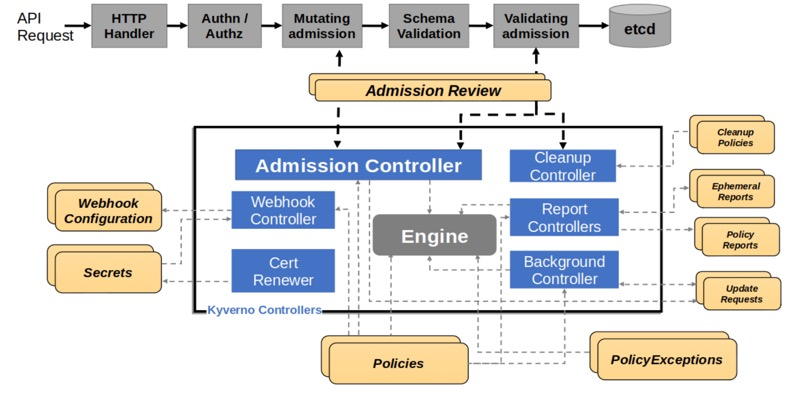

# kyverno - k8s policy management engine

## Overview
Kyverno is a policy as code solution, that enables DevOps engineers manage policies through applying a k8s native manifests. Its main component - the admission controller - creates, mutates and validates k8s resources, by following each rule and specifications configured within a Policy.

## About Admission Controller
Admission Controller in k8s is component that takes part in each request for creating or updating resource within k8s. its responsability is to perform mutations (updates) and validations on a resource that's being requested. In addition, it provides a webhook for external Admission Controllers, that will do beyond the built-in admissions functionality.

## Kyverno Admission Controller
Kyverno provides an external admission controller, extending the built-in controllers via webhooks:
- MutatingAdmissionWebhook
- ValidatingAdmissionWebhook

## How Kyverno works?
By running a dynamic admission controller, kyverno can validate or mutate a request as part of a create update or delete k8s resource flow.

### The Flow:
- API Client Request
        - Client sends a request to create a resource
- Request is being authorized
- Mutating admission controller gets trigger and sends a webhook to the external admission controller (Kyverno)
- Webhook controller watch for the current applied policies and applies only if the request matches any of them.